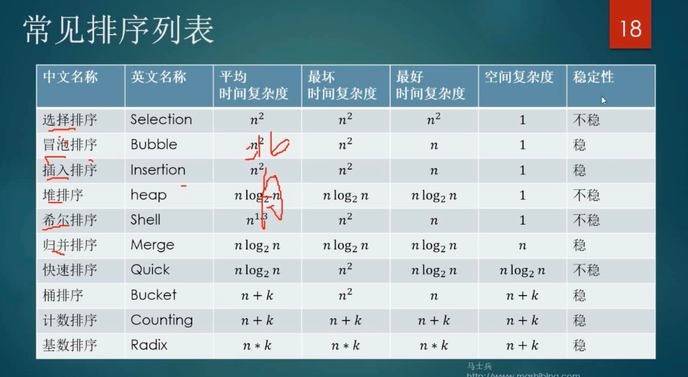

###算法
>https://www.bilibili.com/video/BV1zv411j7QX/?p=5&spm_id_from=pageDriver
> 
###1.整体思路

*1、由简单到负责*
- 验证一步走一步，多打印中间结果

*2、先局部再整体*
- 没思路时先细分

*3、先粗糙后精细*
- 变量更名，语句合并，边界处理

###2.如何验证算法的正确性
- 1、产生足够多的随机样本
- 2、使用正确的算法(比如程序自带的)计算结果
- 3、对比结果
   - 肉眼观察不准确
